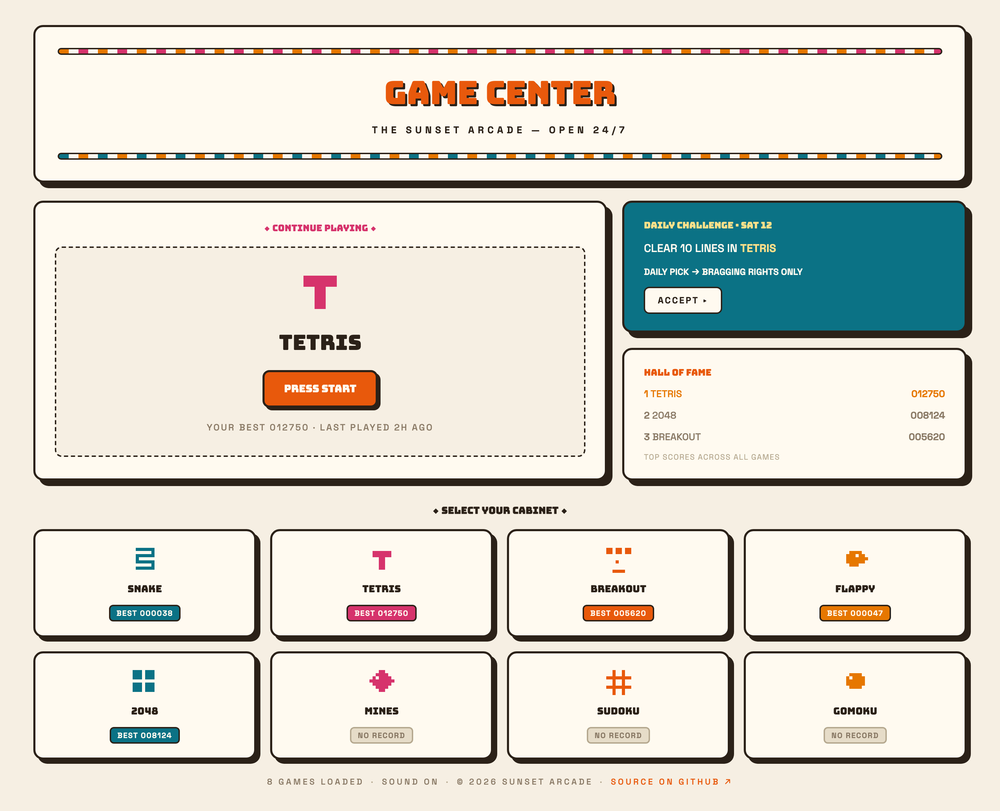
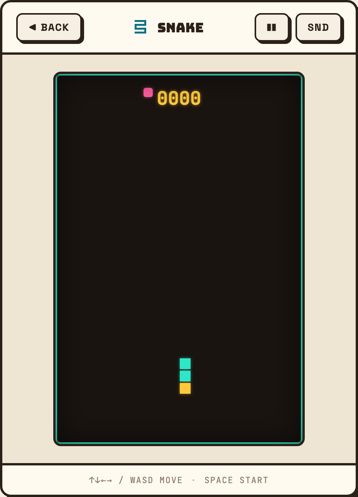
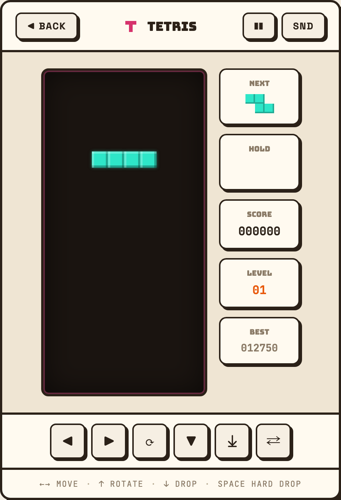
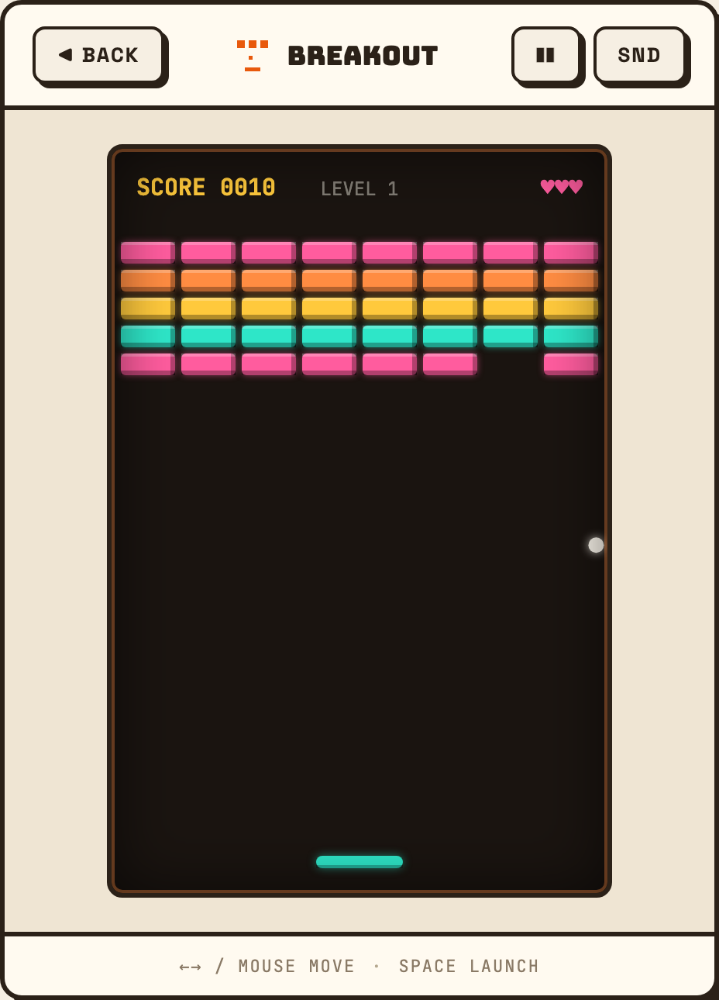
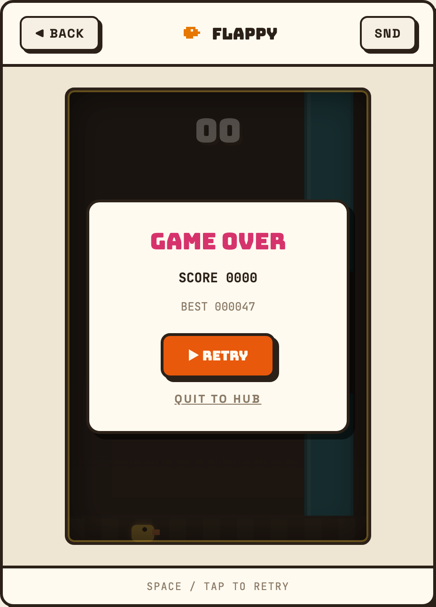
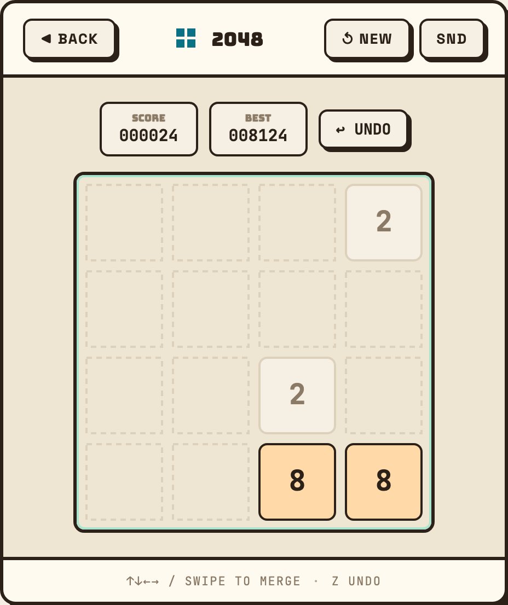
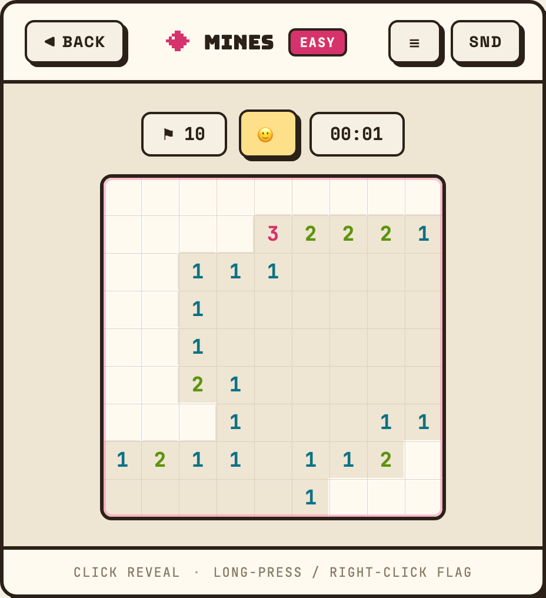
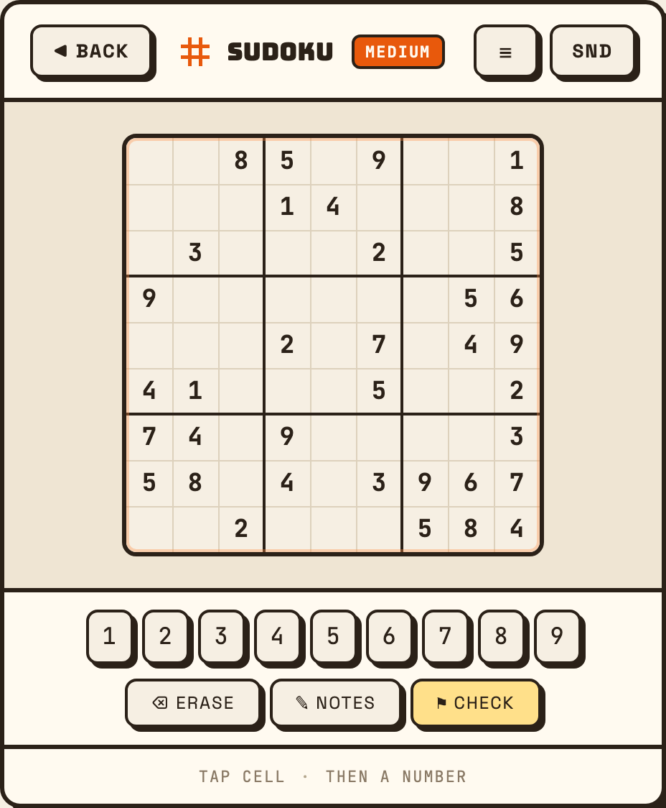
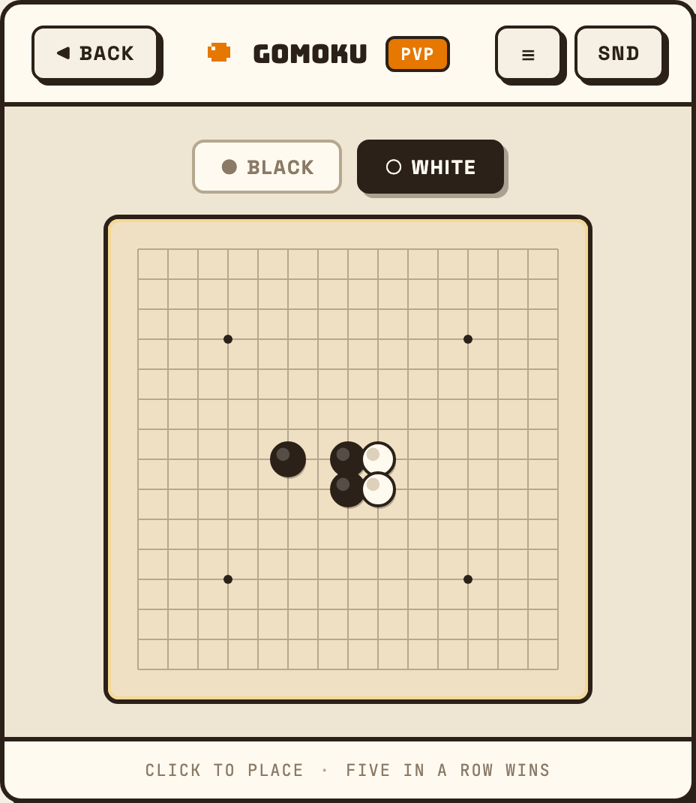

# Retro Arcade · 复古街机

一个跑在浏览器里的迷你街机厅：8 个原生实现的小游戏，一个统一的机柜外壳，无前端框架。

- **在线** — `npm run dev` 后打开 http://localhost:5173
- **技术栈** — Vite 5 + TypeScript 5，DOM 直出 + Canvas 2D，无 React/Vue 等框架，无运行时依赖
- **测试** — Vitest 单测（游戏逻辑与纯函数）+ Playwright 端到端

<p align="center">
  
</p>

## 游戏

8 个游戏共用同一个机柜外壳——顶栏、屏幕井、结算浮层、按键提示条都由 `src/shell/frame.ts`
统一提供，游戏只管把自己画进屏幕里、把控件填进插槽里。

<table>
<tr>
  <td width="50%"></td>
  <td width="50%"></td>
</tr>
<tr>
  <td align="center"><b>SNAKE</b> · 贪吃蛇</td>
  <td align="center"><b>TETRIS</b> · 俄罗斯方块<br><sub>侧栏与触屏键盘是 DOM，不是画在画布里</sub></td>
</tr>
<tr>
  <td></td>
  <td></td>
</tr>
<tr>
  <td align="center"><b>BREAKOUT</b> · 打砖块</td>
  <td align="center"><b>FLAPPY</b> · 提示条显示实时最高分</td>
</tr>
<tr>
  <td></td>
  <td></td>
</tr>
<tr>
  <td align="center"><b>2048</b> · 分数卡与撤销在上方栏</td>
  <td align="center"><b>MINES</b> · 扫雷</td>
</tr>
<tr>
  <td></td>
  <td></td>
</tr>
<tr>
  <td align="center"><b>SUDOKU</b> · 数字盘是真按钮，可 Tab 可聚焦</td>
  <td align="center"><b>GOMOKU</b> · 五子棋，带 AI 对手</td>
</tr>
</table>

五子棋的 AI 跑在 Web Worker 里，不阻塞主线程。所有游戏都支持键盘与触屏，成绩存在
`localStorage`，隐私模式下自动降级为内存存储。

### 深色屏与浅色纸盘

8 个游戏分成两类，配色语言不同：

- **深色屏**（SNAKE / TETRIS / BREAKOUT / FLAPPY）——画布是发光的暖霓虹，共用
  `src/core/theme.ts` 的 `SCREEN`；屏幕井有内描边与暗角。
- **浅色纸盘**（SUDOKU / 2048 / MINES / GOMOKU）——奶油底、墨色描边，每个游戏在自己的
  `index.ts` 里持有 `PAPER` 常量（四者配色确实不同，合并只会得到谁都不合身的抽象）。

棋盘一律画在 canvas 里；数字键盘、难度菜单、计分卡、回合筹这些**周边控件一律是 DOM**——
可 Tab、有焦点环、触屏命中率高，这是画在画布里做不到的。

## 快速开始

```bash
npm install
npm run dev      # 开发服务器
npm test         # 单元测试
npm run e2e      # 端到端测试（需先 npx playwright install）
npm run build    # 类型检查 + 生产构建
npm run preview  # 预览构建产物
```

## 代码结构

```
src/
  core/          与具体游戏无关的基础设施
    loop.ts        变步长游戏循环，dt 上限 50ms（支持暂停/恢复）
    input.ts       键盘、点按、滑动、拖动、长按手势
    audio.ts       WebAudio 音效合成（无音频文件）
    storage.ts     localStorage 封装，不可用时降级到内存
    theme.ts       调色板常量
    game.ts        Game / GameMeta / GameContext 接口
    format.ts      分数补零
  shell/         页面外壳
    router.ts      hash 路由（#/ 为首页，#/<id> 为游戏）
    hub/           首页：model（纯函数）/ view（HTML 字符串）/ index（DOM 与事件）
    frame.ts       游戏机柜：顶栏、屏幕井、结算浮层、按键提示条
    cabinet-view.ts  机柜的纯渲染函数
    accent.ts      配色轮转
    pixel-icons.ts 8×8 像素图标 → 内联 SVG
    escape.ts      HTML 转义（view 层都用字符串拼 HTML）
  games/<id>/
    logic.ts       纯逻辑：状态与规则，不碰 DOM/Canvas，可完整单测
    index.ts       渲染与输入：把 logic 的状态画到 canvas 上
```

### 一条贯穿全局的约定：逻辑与渲染分离

每个游戏都拆成 `logic.ts` 与 `index.ts`。**`logic.ts` 里没有任何 DOM 或 Canvas 调用**，
状态转移是纯函数，所以能脱离浏览器完整单测——`tests/*-logic.test.ts` 就是这么来的。
`index.ts` 只负责把状态画出来、把输入翻译成逻辑调用。

这条约定的直接好处：整轮视觉改版可以只动 `index.ts`，`logic.ts` 与其单测一行不改，
「有没有不小心改到玩法」因此变成一条可执行的检查：

```bash
git diff --stat <基线> -- 'src/games/*/logic.ts' 'tests/*-logic.test.ts'   # 应为空
```

### 游戏怎么接进机柜

游戏实现 `Game` 接口（`src/core/game.ts`），由 `frame.ts` 挂载。机柜通过 `GameContext`
向游戏提供音效、存储、输入、结算浮层与可选的侧栏/控制垫插槽：

```ts
ctx.settle({ title: 'GAME OVER', tone: 'lose', lines: [...], action: {...} });
ctx.settle(null);            // 收起浮层
ctx.setHints(['BEST 000042']); // 替换底部提示条
```

`GameMeta` 上的 `side` / `pad` / `pausable` / `hints` / `screen` 决定机柜为这个游戏渲染
成什么样。新增游戏时在 `src/games/registry.ts` 登记即可，首页会自动出现对应卡片。

## 开发工作流

`docs/superpowers/` 记录了每一轮改动的设计与计划：

- `specs/` — 设计文档：要做什么、范围决策、刻意的取舍与偏离
- `plans/` — 实现计划：拆成可独立验收的任务，每步含完整代码与验证命令

动手前先写 spec 再写 plan，是这个仓库一直以来的做法。范围决策和「为什么没照设计稿做」
都记在 spec 里，代码里则用注释钉住那些不写就会被后人「修正」回去的地方。

## 视觉

主题叫 **Sunset Arcade**：奶油纸底、墨色描边配硬投影、四色轮转的暖色 accent、
CSS 绘制的像素图标（每个游戏一个 8×8 网格，渲染成内联 SVG）。

**页面色板的唯一真相源是 `src/styles/arcade.css` 的 `:root`**；TypeScript 侧只持有必须由
JS 内联的那部分。画布内配色是另一回事，见上面「深色屏与浅色纸盘」。两边都有的值
（accent 四色、`--screen-ground`）在两处都写了交叉引用注释。

## License

未指定。
