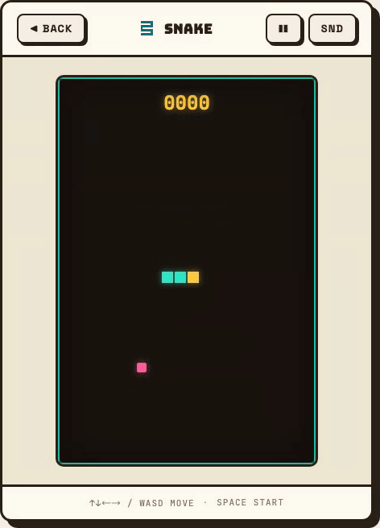
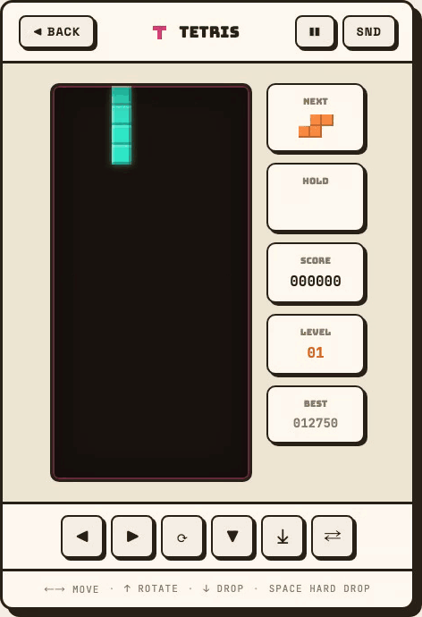
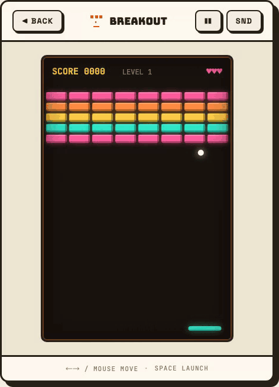
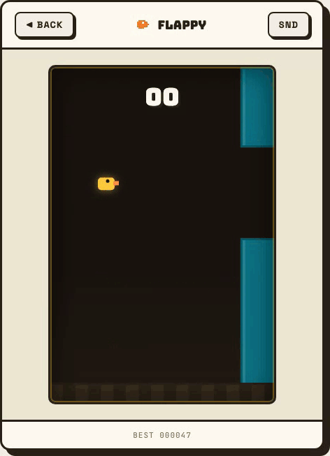
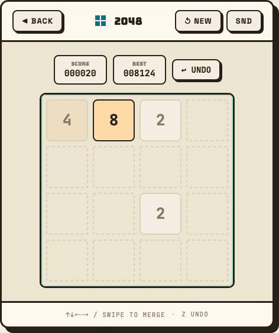
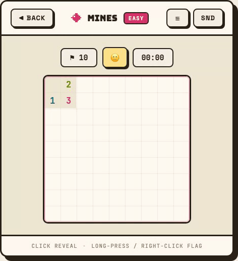
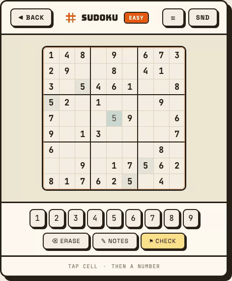
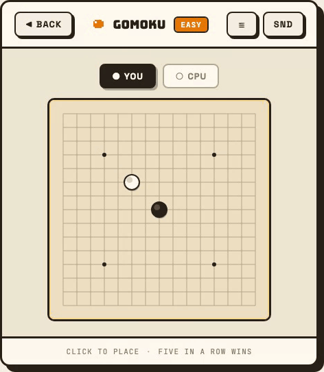

# 🕹️ Retro Arcade · 复古街机

**8 个经典小游戏装进一台浏览器机柜。无框架，打包后 35 KB，全量测试。**

[English](README.md) · [中文](README.zh-CN.md)

[](https://minjia-hu.github.io/retro-arcade/)

[](https://github.com/Minjia-Hu/retro-arcade/actions/workflows/ci.yml)
[](LICENSE)


<p align="center">
  
</p>

## 亮点

- **小。** 整个街机厅——8 个游戏、五子棋 AI、全部界面——打包后 **gzip 35 KB**，比一张普通截图还小。
- **零运行时依赖。** 构建期用 Vite + TypeScript；浏览器里只有原生 DOM 和 Canvas 2D。没有 React，没有游戏引擎。
- **每条规则都是纯函数。** 每个游戏的逻辑不碰 DOM 和 Canvas，可以脱离浏览器测试：规则层 **268 条单测**，界面层 **28 条 Playwright 端到端**，全部跑在 CI 里。
- **键盘和触屏都行。** 滑动控制蛇、长按插旗、点真按钮输入数字——需要无障碍的控件是 DOM，不是画上去的像素。
- **五子棋 AI 在主线程之外思考。** Web Worker 里跑 α-β 剪枝的极小极大搜索，三档强度。
- **无后端、无追踪。** 成绩只存在 `localStorage`，唯一的网络请求是 Google Fonts。

## 游戏

<table>
<tr>
  <td width="50%"></td>
  <td width="50%"></td>
</tr>
<tr>
  <td align="center"><b>SNAKE</b> · 贪吃蛇<br><sub>越吃越快 · 方向键 / WASD / 滑动</sub></td>
  <td align="center"><b>TETRIS</b> · 俄罗斯方块<br><sub>7-bag、暂存、硬降 · ← → ↑ ↓ 空格 C，或屏幕上的按键垫</sub></td>
</tr>
<tr>
  <td></td>
  <td></td>
</tr>
<tr>
  <td align="center"><b>BREAKOUT</b> · 打砖块<br><sub>三种砖块布局，逐关加速 · ← → / 拖动，空格发球</sub></td>
  <td align="center"><b>FLAPPY</b><br><sub>提示条实时显示最高分 · 空格 / ↑ / 点按</sub></td>
</tr>
<tr>
  <td></td>
  <td></td>
</tr>
<tr>
  <td align="center"><b>2048</b><br><sub>单步撤销，且不能拿来刷新砖 · 方向键 / 滑动，Z 撤销</sub></td>
  <td align="center"><b>MINES</b> · 扫雷<br><sub>三档尺寸，首点必安全 · 点击翻开，长按或右键插旗</sub></td>
</tr>
<tr>
  <td></td>
  <td></td>
</tr>
<tr>
  <td align="center"><b>SUDOKU</b> · 数独<br><sub>现场生成唯一解题面，笔记，自动存档 · 点格子再按 1–9，N 切笔记</sub></td>
  <td align="center"><b>GOMOKU</b> · 五子棋<br><sub>双人或 AI 简单 / 中等 / 困难 · 点击落子</sub></td>
</tr>
</table>

## 本地运行

需要 Node 20.19+（或 22.12+）。只支持现代浏览器（Chrome 99+、Safari 16+、Firefox 112+）。

```bash
git clone https://github.com/Minjia-Hu/retro-arcade.git
cd retro-arcade
npm install
npm run dev        # http://localhost:5173
```

```bash
npm test           # 单元测试（Vitest）
npm run e2e        # 端到端（Playwright，需先 npx playwright install 一次）
npm run build      # 类型检查 + 生产构建
```

## 它是怎么搭的

**一台机柜，八个游戏。** 外壳（`src/shell/frame.ts`）负责顶栏、屏幕井、结算浮层和提示条。游戏实现一个接口，
拿到一个 `GameContext`：音效、存储、输入手势、浮层，以及可选的 DOM 插槽（上方栏、侧栏、触屏垫）。

```ts
ctx.overlay({
  title: 'GAME OVER',
  tone: 'lose',
  lines: ['SCORE 000420', 'BEST 001330'],
  actions: [{ label: '▶ RETRY', onPress: retry }],
  hints: ['SPACE / TAP TO RETRY'],
});
```

**逻辑与渲染永不混写。** 每个游戏都是 `logic.ts` + `index.ts`。`logic.ts` 只有状态和规则——没有 DOM、
没有 Canvas、随机源可注入——所以整套规则能脱离浏览器做单测。`index.ts` 负责把状态画出来、把输入翻译成
逻辑调用。这个项目做过一整轮视觉改版，只动了 `index.ts`，规则和它们的测试一行没改。

**棋盘画在 canvas 上，控件放在 DOM 里。** 网格和精灵是画的；凡是人要去按的——数字盘、难度菜单、撤销键——
都是真的 `<button>`，有焦点环，有像样的触屏命中区。

**两种视觉语言。** 深色屏（贪吃蛇、俄罗斯方块、打砖块、Flappy）是暖色霓虹；纸盘（2048、扫雷、数独、五子棋）
是奶油底上的墨线。主题叫 *Sunset Arcade*：硬投影、四色轮转的 accent、渲染成内联 SVG 的 8×8 像素图标。

```
src/
  core/      游戏循环、输入手势、WebAudio 合成音效、存储、画布尺寸
  shell/     hash 路由、首页、机柜外壳
  games/<id>/
    logic.ts   纯规则，完整单测
    index.ts   渲染 + 输入
```

## 加一个游戏

1. 新建 `src/games/<id>/logic.ts`（纯状态 + 规则）和 `index.ts`（实现 `src/core/game.ts` 的 `Game`）。
2. 在 `src/games/registry.ts` 登记——首页卡片、配色和路由自动出现。
3. 在 `src/shell/pixel-icons.ts` 加一个 8×8 像素图标，写一份 `tests/<id>-logic.test.ts`。

约定、设计文档和测试规则见 [CONTRIBUTING.md](CONTRIBUTING.md)。

## License

[MIT](LICENSE)
